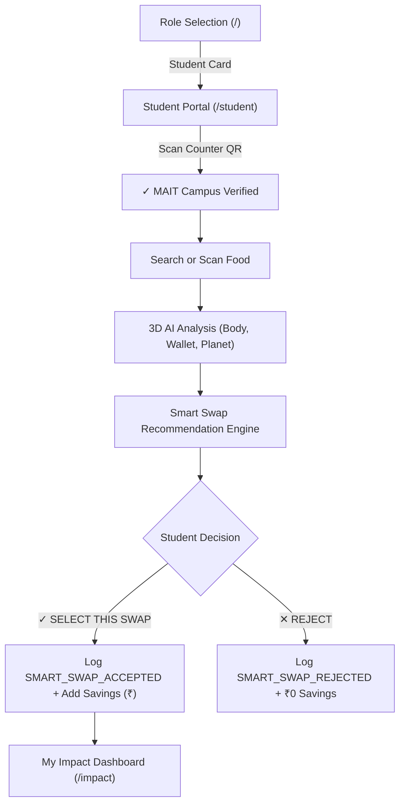
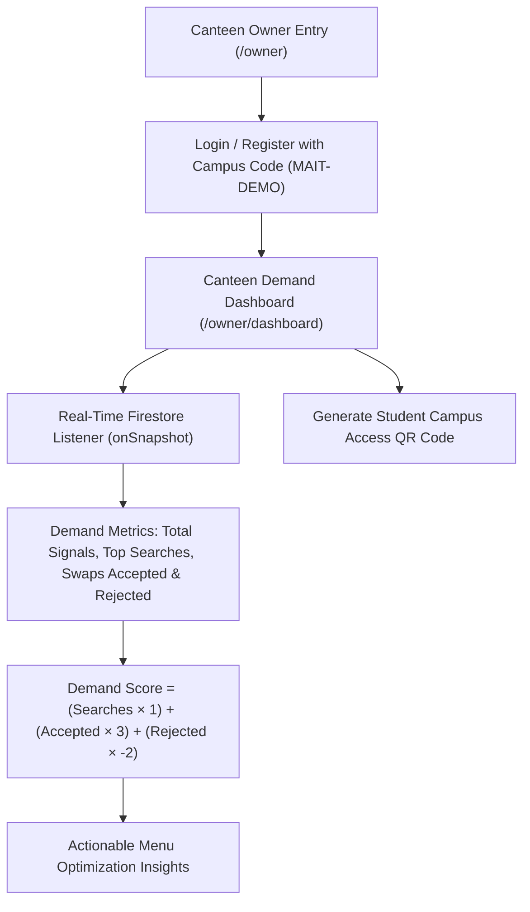

# EcoBite AI — Final Product Flow & Student Demand Intelligence

## Core Architectural Doctrine

EcoBite AI is built on a clear, grounded product principle:
1. **EcoBite is NOT a Sales Tracker**: It never claims to know exact canteen cash register sales or transaction volumes.
2. **EcoBite is NOT a Physical Waste Sensor**: It does not place scales on trash bins or claim physical food waste kg measurements.
3. **EcoBite IS a Student Demand Intelligence Platform**:
   - For **Students**: A conscious campus food companion that analyzes nutritional quality, budget benchmarks, and carbon footprint, then offers like-for-like verified campus Smart Swaps.
   - For **Canteens**: A real-time pre-purchase demand intelligence engine that captures what students are searching for, what healthy alternatives they accept, and what they reject — allowing kitchens to plan batch cooking **before** food is prepared.

---

## 1. Role-Selection Landing Screen (`/`)
The root view presents two prominent portals:
- **[ STUDENT PORTAL ]** (`/student`): Direct access for campus diners without forced registration.
- **[ CANTEEN OWNER PORTAL ]** (`/owner`): Dedicated dashboard for cafeteria operators, protected by campus authorization (`MAIT-DEMO`).

---

## 2. The Student Journey

1. **Campus Verification**:
   - Students scan the official campus QR code at the cafeteria counter or enter campus code `MAIT-DELHI-01`.
   - Unlocks verified stall names (Food Mast, Amul Shop, Juice Point) and exact menu pricing.
2. **Food Discovery**:
   - Instant search across Indian canteen staples or live camera scan.
   - Triggers an anonymous `SEARCH` demand signal.
3. **AI Food Analysis**:
   - Health score, budget benchmarks, and sustainability score.
4. **Smart Swap Engine**:
   - **Strict Like-for-Like Category Matching**: `MEAL` $	o$ `MEAL`, `SNACK` $	o$ `SNACK`, `BEVERAGE` $	o$ `BEVERAGE`, `DESSERT` $	o$ `DESSERT`.
   - **Price Proximity Rule**: Candidates costing $>10\%$ above the original price are strictly disqualified (`MAX_PRICE_DEVIATION = 0.10`).
   - If no candidate qualifies: *"No healthier verified campus option found within your price range."*
5. **Student Choice**:
   - `[ ✓ SELECT THIS SWAP ]`: Logs `SMART_SWAP_ACCEPTED`, records pocket savings (₹), updates weekly impact.
   - `[ ✕ REJECT ]`: Logs `SMART_SWAP_REJECTED`, records ₹0 savings, captures authentic student preference.

---

## 3. The Canteen Owner Journey

1. **Authentication**:
   - Canteen owners register or log in with Campus Code (`MAIT-DEMO`).
   - 1-Click Judge Access button provided for evaluations.
2. **Real-Time Demand Dashboard**:
   - **Total Demand Signals**: Live query volume + swap decisions.
   - **Searches Logged**: Pre-purchase interest before cooking begins.
   - **Swaps Accepted**: Positive conversion to healthy alternatives.
   - **Swaps Rejected**: Direct feedback on dishes students decline.
3. **Weighted Demand Scoring Formula**:
   $$\text{Demand Score} = (\text{Searches} \times 1) + (\text{Accepted} \times 3) + (\text{Rejected} \times -2)$$
4. **Actionable Menu Optimization**:
   - High Interest dishes (e.g. *Paneer Sandwich*, *Chole Bhature*, *Rajma Chawal*): Maintain morning prep.
   - Low Acceptance / Rejected items (e.g. *Singapori Chowmein*): Cook upon order to prevent waste.
5. **Counter QR Generator**:
   - Button `[ Generate Student Campus QR ]` opens printable SVG QR code with campus token (`MAIT-DELHI-01`).

---

## 4. Two-Device Presentation Walkthrough

EcoBite AI is engineered for a synchronized two-screen demonstration:
- **Device 1 (Laptop / Mobile): Student Experience**
  1. Open `/student` (or scan counter QR).
  2. Search *Chole Bhature*.
  3. View 3D evaluation and the recommended *Paneer Sandwich* or *Rajma Chawal* Smart Swap.
  4. Click `[ ✓ SELECT THIS SWAP ]` $	o$ see instant ₹40 savings confirmed.
  5. Visit `/impact` to see updated personal savings.
- **Device 2 (Second Laptop / Large Display): Canteen Owner Dashboard**
  1. Open `/owner` and enter dashboard.
  2. Watch the live Demand Signals counter increment in real time via Firestore `onSnapshot`.
  3. Observe *Paneer Sandwich* score rise with +3 points for the accepted swap.
